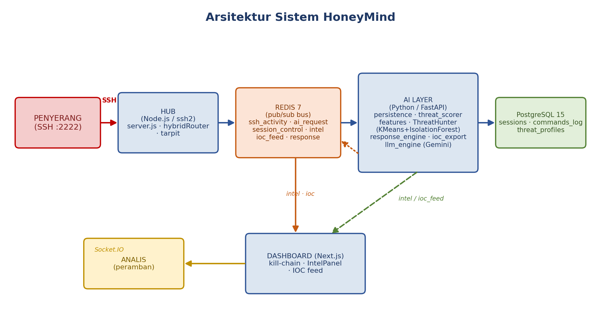
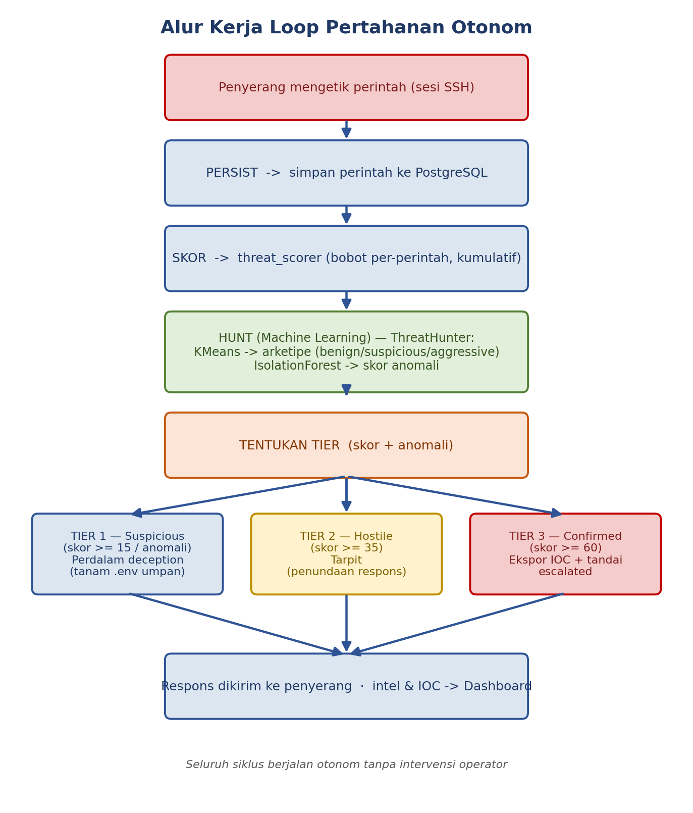

# Dokumen Arsitektur — HoneyMind

> Audiens: pengembang, peninjau teknis (juri WreckIT 7.0), dan anggota tim baru.
> Untuk cara menjalankan sistem, lihat [RUNBOOK.md](RUNBOOK.md). Untuk orientasi tim, lihat [ONBOARDING.md](ONBOARDING.md).

## 1. Konteks & Tujuan

Serangan siber modern berlangsung otomatis dan cepat, sementara pertahanan reaktif (berbasis *signature*/aturan statis) selalu tertinggal. *Honeypot* konvensional dapat memikat penyerang, tetapi bersifat statis, mudah dikenali, dan tidak mengubah interaksi menjadi intelijen yang dapat ditindaklanjuti.

**Tujuan HoneyMind:** menjadikan *deception* sebagai **pertahanan otonom**. Sistem memikat penyerang ke lingkungan umpan, lalu menjalankan **loop tertutup**: *persist → skor → hunt (ML) → tentukan tier → respons*, hingga menerbitkan IOC untuk perimeter nyata — tanpa intervensi operator.

**Non-tujuan (batas sadar):** HoneyMind bukan IDS/IPS produksi, bukan firewall, dan tidak mengeksekusi pemblokiran nyata (hanya *menyarankan* aturan). Lihat §6.

## 2. Desain Tingkat Tinggi

Tiga layanan **ter-dekopel penuh** yang hanya berkomunikasi lewat **Redis pub/sub** — tidak ada panggilan HTTP langsung antarlayanan, sehingga tiap layanan dapat dikembangkan/diganti/diskalakan mandiri.

| Layanan | Teknologi | Tanggung jawab |
|---|---|---|
| **Hub** (`hub/`) | Node.js + `ssh2` | Server SSH palsu (port 2222), emulasi shell PTY, pemilahan perintah statis vs. AI, penerapan *tarpit* |
| **AI Layer** (`ai/`) | Python + FastAPI | Persistensi, penskoran, *threat hunting* ML, mesin respons, ekspor IOC, emulasi terminal LLM |
| **Dashboard** (`dashboard/`) | Next.js + React + Socket.IO | Visualisasi *real-time*: umpan terminal, pohon *kill-chain*, panel intelijen, umpan IOC |
| **Data store** | Redis 7, PostgreSQL 15 | Bus pesan & penyimpanan durable |

### Komponen AI Layer (`ai/`)
- `main.py` — dua *listener* asinkron (`channel:ai_request` & `channel:ssh_activity`); memuat model ML saat *startup*.
- `persistence.py` — inti loop: konsumsi `ssh_activity` → simpan perintah + skor → jalankan `ThreatHunter` → tentukan tier → publikasikan kontrol/intel/IOC.
- `threat_scorer.py` — `command_weight()`: bobot bahaya per-perintah (mis. `nmap`/`nc`=15, `wget`/`curl`=10, `cat`=5, `ls`=1).
- `features.py` — ekstraksi 6 fitur sesi: jumlah perintah, rasio perintah berbahaya, rata-rata interval, rasio perintah unik, entropi, ancaman maksimum.
- `detection.py` — `ThreatHunter`: **KMeans** (arketipe `benign`/`suspicious`/`aggressive`) + **Isolation Forest** (skor anomali); disimpan via `joblib`.
- `response_engine.py` — `decide_tier(skor, anomali)` & `tarpit_ms_for_tier(tier)`.
- `ioc_export.py` — `build_ioc()`: bundel gaya MISP (IP sumber, URL payload, daftar perintah, saran aturan `iptables`).
- `llm_engine.py` — Google Gemini (`gemini-2.5-flash`) meniru terminal Ubuntu; memperdalam tipuan pada tier ≥ 1.
- `db.py` — lapisan akses PostgreSQL (membaca `DATABASE_URL`).

## 3. Alur Data — Loop Otonom

Setiap perintah memicu satu putaran loop:

| Tier | Pemicu | Tindakan otonom |
|---|---|---|
| 0 — benign | skor < 15 | tidak ada |
| 1 — suspicious | skor ≥ 15 **atau** anomali | perdalam *deception* (tanam `.env` umpan via LLM) |
| 2 — hostile | skor ≥ 35 | *tarpit* (tunda respons 1.500 ms) |
| 3 — confirmed | skor ≥ 60 | terbitkan IOC + tandai `is_escalated`; *tarpit* 4.000 ms |

### Kanal Redis (kontrak antarlayanan)

| Kanal | Penerbit | Pelanggan | Muatan |
|---|---|---|---|
| `channel:ssh_activity` | hub | dashboard, AI (persistensi) | `{ session_id, ip_address, command, timestamp }` |
| `channel:ai_request` | hub | AI | `{ session_id, command, response_channel }` |
| `response:<uuid>` | AI | hub | `{ response }` |
| `channel:session_control` | AI | hub | `{ session_id, tier, tarpit_ms }` |
| `channel:intel` | AI | dashboard | `{ session_id, ip_address, score, archetype, anomaly_score, tier }` |
| `channel:ioc_feed` | AI | dashboard | bundel IOC |

> **Aturan emas:** setiap pesan antarlayanan baru WAJIB didokumentasikan di tabel ini. Layanan tidak boleh saling mengimpor kode.

## 4. Skema Basis Data (`schema.sql`)

| Tabel | Tujuan | Kolom kunci |
|---|---|---|
| `sessions` | Satu baris per koneksi SSH | `session_id` (unik), `ip_address`, `start_time`, `threat_score`, `is_escalated` |
| `commands_log` | Setiap perintah | `session_id` (FK), `command`, `response`, `timestamp`, `is_llm_generated`, `threat_value` |
| `threat_profiles` | Sidik jari perilaku per-IP | `ip_address` (unik), `cluster_label` (arketipe), `last_seen` |

## 5. Keputusan & Trade-off

- **Redis pub/sub, bukan panggilan langsung.** Dekopling memungkinkan pengembangan paralel & ketahanan; biayanya: tidak ada jaminan pengiriman (pub/sub bersifat *fire-and-forget*) — dapat diterima untuk honeypot, tetapi bukan untuk transaksi kritis.
- **LLM untuk deception, ML untuk hunting.** LLM (Gemini) memberi respons dinamis yang sulit di-*fingerprint*; ML (KMeans+Isolation Forest) memberi klasifikasi yang dapat diinterpretasikan + deteksi anomali. Keduanya dipisah agar masing-masing dapat diganti.
- **Penskoran di jalur persistensi.** Skor dihitung saat konsumsi `ssh_activity` (mencakup SEMUA perintah, statis & AI), bukan hanya jalur LLM — lebih akurat daripada versi awal yang hanya menskor perintah kompleks.
- **Data sintetis untuk pelatihan.** `attack_simulator` menghasilkan data berlabel & demo yang dapat diulang; trade-off: generalisasi ke serangan dunia nyata belum tervalidasi (lihat roadmap).
- **Respons "tarpit + IOC", bukan blokir di honeypot.** Memblokir penyerang di honeypot meniadakan nilai intelijennya; HoneyMind justru memperlambat (*tarpit*) dan mengekspor IOC agar perimeter NYATA yang bertindak.

## 6. Titik Integrasi & Batasan

- **Masuk:** koneksi SSH penyerang (port 2222). **Keluar:** bundel IOC (gaya MISP/JSON) + saran aturan `iptables`; saat ini *belum* terhubung otomatis ke STIX/TAXII, platform MISP, atau firewall.
- **Ketergantungan eksternal:** Google Gemini API (untuk respons LLM; sistem tetap berjalan tanpa kunci API — hanya respons terminal yang nonaktif).
- **Roadmap (di luar cakupan saat ini):** integrasi STIX/MISP, eksekusi aturan firewall nyata, *deception* adaptif berbasis RL, autentikasi dashboard, dan *retraining* model terjadwal.
